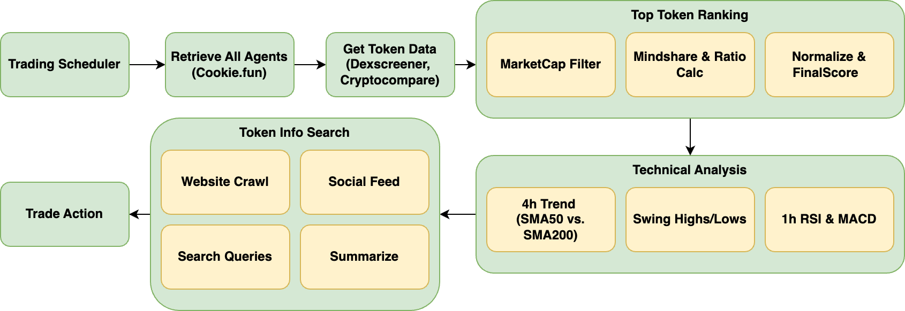

# Trading Pipeline: AI Agent Discovery & Automated TA Tweets

This repository contains `trade.py`, a Python module that orchestrates an end-to-end pipeline for:

1. **Discovering** top-performing crypto tokens based on *CookieToolkit*’s mindshare metrics  
2. **Analyzing** token fundamentals and technical data (via *DexscreenerToolkit*, *TechnicalAnalysis*, SearchTool, etc)
3. **Generating** short tweets recommending a LONG (buy) or SHORT (sell) position  

---

## System Overview Diagram



Below is a high-level overview illustrating how the pipeline fetches, analyzes, and acts on token data. 


1. **Trading Scheduler**  
   - Periodically triggers the main pipeline (`trade.py`) to kick off data retrieval and analysis.

2. **Retrieve All Agents (Cookie.fun)**  
   - Calls `cookie_toolkit.get_all_agents(...)` or `cookie_toolkit.get_top_agents(...)` to compile a list of tokens, filtering by market cap and ranking via mindshare metrics.

3. **Get Token Data (DexScreener, CryptoCompare)**  
   - Queries real-time price, volume, liquidity, and other fundamentals for each token.

4. **Top Token Ranking**  
   - **MarketCap Filter**: Excludes tokens below a certain threshold.  
   - **Mindshare & Ratio Calc**: Uses mindshare, follower counts, etc. to identify undervalued projects.  
   - **Normalize & FinalScore**: Applies robust/logarithmic normalization; generates a final ranking score.

5. **Technical Analysis**  
   - **4h Trend (SMA50 vs. SMA200)**: Gauges mid-term momentum.  
   - **Swing Highs/Lows**: Locates potential support/resistance levels.  
   - **1h RSI & MACD**: Determines immediate bullish/bearish signals.  
   - Produces an overall recommendation: **LONG**, **SHORT**, or **NO_ACTION**.

6. **Token Info Search**  
   - **Website Crawl**: Extracts additional context from the project’s official site.  
   - **Social Feed (x_content)**: Integrates real-time social chatter.  
   - **Search Queries**: Generates questions via Vertex AI, then scans the web for relevant info.  
   - **Summarize**: Merges all data into a concise token summary.

7. **Trade Action**  
   - If the pipeline deems a token’s TA signals a clear LONG or SHORT opportunity, a final tweet is generated.  
   - The tweet references mindshare stats, TA findings, and any newly discovered information from Token Info Search.  
   - **Automated Trading (via Jupiter Python SDK)**:  
     - On a **LONG** signal, the pipeline allocates a portion of SOL (e.g., 5% of the bot’s balance) and executes a swap to the target token using `jupiter_toolkit.swap_token(...)`.  
     - The new position is saved in MongoDB with `take_profit` and `stop_loss` levels.  
     - A scheduled job (`check_take_profit`) periodically compares the token’s current price to these thresholds and automatically **sells** if the price triggers a profit or a stop-loss condition.

---

## How Top Tokens Are Determined

Within **`cookie.py`** (the `CookieToolkit`), the function `get_top_agents(interval, k)` implements a pipeline to pick the most "promising" agents based on mindshare, market cap, and other advanced metrics. Here’s a high-level overview:

1. **Fetch All Agents**: The function `get_all_agents(interval)` pages through the Cookie API (up to 25 agents per page), accumulating a list of agents that match the given chain (default `chain_id = -2`).
2. **Filter**: Excludes any agent whose `marketCap` is below 100,000.
3. **Compute Ratios**: For each agent, it calculates mindshare ratio, smart followers ratio, and holders ratio. It also uses the average ratio across all agents (e.g., `avg_mindshare_ratio`) to determine if a specific agent might be undervalued.
4. **Raw Score**: A `score_delta` is formed from `mindshareDeltaPercent` plus `volume24HoursDeltaPercent`, then combined with a P/E–like adjustment score (`pe_adjustment_score`) based on ratio metrics.
5. **Normalize Scores**: Calls `_normalize_agent_scores` to apply robust/logarithmic normalization to each metric (e.g., mindshare, ratio scores), ensuring outliers don’t dominate.
6. **Final Score**: Summarizes all normalized components into `finalScore`, giving an overall rank of the agent’s potential.
7. **Sort & Return**: Agents are sorted by `finalScore` in descending order, and only the top `k` are returned.

These steps yield a data-driven shortlist of tokens likely to have the best combination of mindshare growth, volume changes, and undervaluation signals.

---

## How Technical Analysis is Performed

Within **`analysis/ta.py`** (the `TechnicalAnalysis` class), the function `comprehensive_ta_analysis(...)` applies multi-timeframe TA using **TA‑Lib** and CryptoCompare data:

1. **4-Hour Data**: Fetches ~200 four-hour candles to:
   - Compute 50-period & 200-period SMAs (SMA50_4h vs. SMA200_4h) for mid-term trend detection.
   - Identify swing highs/lows within a recent lookback window (default: 50 bars), used to define support/resistance.
2. **1-Hour Data**: Gathers up to 100 one-hour candles to:
   - Compute RSI(14) for short-term overbought/oversold conditions.
   - Compute MACD(12,26,9) to assess bullish/bearish momentum.
3. **Scoring & Recommendation**:
   - Each indicator contributes to a cumulative score (e.g., bullish SMAs, oversold RSI, and positive MACD histogram add points).
   - If the total score ≥ +2 → **LONG** recommendation. ≤ −2 → **SHORT**. Otherwise → **NO_ACTION**.
4. **Suggested Trade**: Uses recent local highs/lows to propose an `entry`, `stop_loss`, and `take_profit` level when the recommendation is LONG or SHORT.
5. **Final Report**: Outputs a JSON dict with `recommendation`, `overall_score`, `indicator_values`, `swing_levels`, and `suggested_trade`.

These steps provide mid-term trend context (4h data) plus immediate momentum signals (1h RSI & MACD) for a holistic recommendation.

---

## Additional Token Information Search

Within `pipeline/token_summary.py`, the function `get_token_summary(token_data)` demonstrates how the bot can discover extra token details:

1. **Website Crawling**: For each URL listed in the token’s info, the system retrieves textual content with `extract_text_from_url(...)`, providing further context about the project.
2. **X/Twitter Content**: If `x_content` is present, it merges community or social feed signals.
3. **Google Questions**: A Vertex AI model is prompted (see `token_clear_ques_prompt`) to generate relevant search queries. The bot then calls a custom search function (`search(q)`) and merges results into a single “search_results” string.
4. **Summarization**: Finally, a second Vertex AI call (`chat_generate_content(...)` with `token_summary_prompt`) produces a concise summary of the token’s references, community sentiment, or discovered facts, which can be appended to your final dataset.

This approach allows your pipeline to gather multiple data signals—project website, social feed, broader web results—before finalizing a tweet or TA recommendation.

---

## Requirements

- **Python 3.9+** (recommended)
- **MongoDB** 

Install everything listed in `requirements.txt`:
```bash
pip install -r requirements.txt
```

---

## Environment Variables

You can store sensitive values and configuration in a `.env` file. For example:

```
COOKIE_API_KEY=YOUR_COOKIE_API_KEY
COMPARE_CRYPTO_API_KEY=YOUR_CRYPTO_API_KEY
MONGO_URI=mongodb://localhost:27017/
MONGO_DB=token_db
MONGO_COLL=tweet_history
TELEGRAM_BOT_TOKEN=YOUR_TELEGRAM_BOT_TOKEN
TELEGRAM_CHAT_ID=-1001234567890
```

**Key Variables**:

- **COOKIE_API_KEY**: For CookieToolkit
- **COMPARE_CRYPTO_API_KEY**: For TechnicalAnalysis (e.g., CryptoCompare)
- **MONGO_URI** / **MONGO_DB** / **MONGO_COLL**: Your MongoDB instance details
- **TELEGRAM_BOT_TOKEN** / **TELEGRAM_CHAT_ID**: For sending generated tweets to your Telegram channel

---

## Usage

1. **Clone/Download** this repository.
2. **Install dependencies**:
   ```bash
   pip install -r requirements.txt
   ```
3. **Create/Update** your `.env` file with the necessary keys (API keys, Mongo URI, Telegram token, etc.).
4. **Run**:
   ```bash
   python trade.py
   ```
   - The script will:
     1. Load environment variables
     2. Retrieve top tokens (20 by default)
     3. Check each for recent tweets in MongoDB
     4. Fetch DexScreener data & run TA
     5. Generate a tweet, store it in MongoDB, and send to Telegram
   - By default, it also schedules itself to repeat every 10 minutes (via `schedule`). You can adjust the frequency in `trade.py`.

---

## Customizing

- **Filters/Criteria**: Adjust how top agents are selected (e.g., daily timeframe, number of tokens).  
- **TA Logic**: Modify `TechnicalAnalysis` or thresholds for `LONG`/`SHORT`.  
- **Tweet Format**: Tweak `generate_tweet` or the prompt to suit your style.  
- **Telegram Integration**: Replace or expand `send_telegram_message` to integrate with other channels (e.g., Twitter API, Discord).

---

## Contributing

1. Fork the repository and create a new branch for your feature or bugfix.
2. Make changes and test thoroughly.
3. Submit a pull request with a clear summary of your changes.

---

## Contact

For questions or support, contact **Phu Trinh** at [phutrinh@naki.ai](mailto:phutrinh@naki.ai).

---

**Enjoy discovering tokens and automating your crypto trades!**

